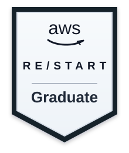

**English** | [Português (Brasil)](./README.pt-BR.md) | [Português (Portugal)](./README.pt-PT.md)

# Samuel Maia | Data Analyst | BI | Analytics Engineering

  
  
  
  
  
  
  
  

  

I am a data professional based in Fortaleza, Brazil, focused on building practical analytical solutions that connect data, business, quality, and decision-making.

I work with SQL, Power BI, Excel, Python/Pandas, ETL/ELT, Streamlit, DuckDB, dbt, GitHub Actions, testing, documentation, data quality, and AWS Cloud fundamentals. My background also includes business experience in commercial operations, team leadership, training, negotiation, and performance monitoring.

I am open to opportunities as a Data Analyst, BI Analyst, Analytics Engineer, Junior Data Analyst, Junior BI Analyst, or freelance data projects. I am especially interested in teams that value clear communication, consistent delivery, business understanding, documentation, and continuous learning.

## What I can help with

- Build dashboards and analytical reports for business teams.
- Treat, clean, validate, and organize datasets for analysis.
- Create KPIs, business rules, and data dictionaries.
- Automate recurring analysis with Python, SQL, and spreadsheets.
- Structure simple analytical pipelines and curated datasets.
- Support data quality, documentation, and governance routines.
- Translate business questions into clear analytical views.

## Core stack

**Languages and analysis:** Python, SQL, Pandas, NumPy, Advanced Excel  
**BI and visualization:** Power BI, Streamlit, Plotly, Altair  
**Data and modeling:** DuckDB, SQLite, dbt, ETL/ELT, analytical modeling  
**Cloud:** AWS Cloud fundamentals, Linux, networking, security, and databases  
**Quality and engineering:** Pytest, Ruff, Git, GitHub Actions, CI/CD, technical documentation  
**Governance:** data quality, data contracts, data dictionaries, traceability, LGPD awareness  
**Business:** KPIs, revenue, sales, operations, retention, commercial performance, and decision support

## Featured portfolio

### 1) Governed Analytics Platform
**Focus:** data quality, documentation, LGPD awareness, analytical organization, and management consumption.

A practical analytics platform that demonstrates data asset organization, quality checks, documentation, governance concepts, and consumption layers.

**Why this project matters:** it shows concern beyond dashboard delivery by treating data as a reliable product with rules, validations, traceability, and documentation.

Repository: https://github.com/samuelmaia-analytics/Governed-Analytics-Platform  
Streamlit demo: https://governed-analytics-platform.streamlit.app/

---

### 2) Revenue Intelligence Platform Suite
**Focus:** revenue analytics, performance, retention, and decision support.

A solution designed to support revenue and performance analysis with a management view for monitoring indicators, prioritizing risks, and supporting commercial decisions.

**Why this project matters:** it shows the ability to translate data into business intelligence for revenue, retention, and performance.

Repository: https://github.com/samuelmaia-analytics/revenue-intelligence-platform-suite  
Streamlit demo: https://revenue-intelligence-platform-suite.streamlit.app/  
Status: private repository / demo available

---

### 3) Data Analytics Workflow
**Focus:** data cleaning, quality score, Streamlit dashboard, SQLite persistence, and documentation.

An analytical app that receives CSV/XLSX files, applies automated curation, shows data quality indicators, compares raw vs curated data, and supports simple persistence in SQLite.

**Why this project matters:** it demonstrates practical readiness for data analysis, BI, analytical automation, and business-support routines.

Repository: https://github.com/samuelmaia-analytics/data-senior-analytics  
Streamlit demo: https://data-analytics-sr.streamlit.app/

---

### 4) Central de Automação e Operações
**Focus:** operational analytics, SLA/backlog, alerting, automation, and decision support.

An operational control center with business rules, risk indicators, prioritization, and management readability.

**Why this project matters:** it demonstrates practical analytics applied to operational efficiency, monitoring, and prioritization.

Repository: https://github.com/samuelmaia-analytics/central-automacao-operacoes  
Streamlit demo: https://central-automacao-operacoes.streamlit.app/

---

### 5) Olist / Dadosfera Case
**Focus:** e-commerce analytics, data lake-style layers, SQL, documentation, dashboards, and governance.

A technical case with layered data organization, commercial/logistics analysis, documentation, SQL queries, and dashboard publication.

**Why this project matters:** it demonstrates the ability to solve an end-to-end technical challenge with structure, analytical clarity, and governance awareness.

Streamlit demo: https://samuelmaia-032026.streamlit.app/  
Status: technical case

## Complementary projects

| Project | Focus | Repository | Streamlit sample / demo | Status |
|---|---|---|---|---|
| Amazon Sales Analysis | commercial analytics, sales, products, and categories | https://github.com/samuelmaia-analytics/amazon-sales-analysis | https://amazon-sales-analysis-samuemaiapro.streamlit.app/ | public |
| Analise Vendas Python | sales analytics, Python/Pandas, and KPIs | https://github.com/samuelmaia-analytics/analise-vendas-python | https://sales-analytics-dashboardd.streamlit.app/ / https://analys-vendas-python-v2.streamlit.app/ | private repository / demo available |
| Churn Prediction | retention, customer risk scoring, and action prioritization | https://github.com/samuelmaia-analytics/churn-prediction | https://telecom-churn-prediction-samuelmaiapro.streamlit.app/ | private repository / demo available |
| Consolidação BHDigital | data consolidation and analytical organization | https://github.com/samuelmaia-analytics/consolidacao-bhdigital | Demo not publicly confirmed yet | private / under curation |

> Some repositories may be private while they are being reviewed, polished, or prepared for public visibility. Public demos are listed whenever there is a known Streamlit sample.

## Portfolio strengths

- **Business vision:** projects focused on revenue, sales, retention, operations, performance, and decision-making.
- **Practical delivery:** ingestion, treatment, modeling, validation, documentation, dashboarding, and publication.
- **Data quality:** focus on data dictionaries, rules, traceability, quality checks, and LGPD awareness.
- **Consistent technical foundation:** use of Python, SQL, DuckDB, dbt, Streamlit, Power BI, tests, CI/CD, and AWS Cloud fundamentals.
- **Communication with business:** dashboards and narratives designed to connect data to real decisions.
- **Commercial experience:** background with leadership, training, negotiation, customer service, and performance follow-up.

## Resume-aligned experience highlights

### Data Analyst | i9 Life Brasil | 2015-2019
- Built and organized performance indicators for operational and management analysis.
- Used SQL, Excel, Python, and Pandas to treat, validate, consolidate, and analyze data.
- Supported recurring reporting routines, dashboards, metric standardization, and decision-making.

### Data and Infrastructure Analyst | Grupo Boticário Brasil | 2019-2021
- Worked with systems integration, process automation, data validation, and internal analytical support.
- Supported exploratory analysis, data checks, reporting flows, and operational information structuring.

### Commercial Leader and Independent Sales Consultant | Up Essência | 2021-2024
- Led direct sales, customer approach, negotiation, relationship management, and commercial performance follow-up.
- Trained independent sales consultants in product presentation, customer objections, communication, and closing techniques.
- Developed transferable skills for data work: stakeholder communication, commercial reading, negotiation, and results orientation.

### Independent Data and Analytics Projects | 2025-2026
- Built data projects with ingestion, transformation, modeling, validation, documentation, dashboards, and publication.
- Applied Python, SQL, Power BI, Streamlit, DuckDB, dbt, testing, data quality practices, and AWS Cloud fundamentals to simulate real analytics environments.

## Education and certifications

- Postgraduate degree in Innovation and Digital Transformation — in progress, expected completion in 2026
- Postgraduate degree in Data Science — completed
- Bachelor’s degree in Business Administration — completed
- dbt Certification — completed
- [AWS re/Start Graduate](https://www.credly.com/badges/cc8d5464-0903-4c0c-a125-f544aee89683/public_url) — AWS Cloud, cloud computing, Linux, networking, security, Python, databases, and professional cloud practices

## Current focus

- Data Analysis, BI, and Analytics Engineering foundations
- Power BI and decision-oriented dashboards
- SQL, Python, Pandas, and analytical automation
- Data quality, documentation, and governance practices
- AWS Cloud fundamentals and data project deployment
- Technical English for remote and international opportunities

## Contact

GitHub: https://github.com/samuelmaia-analytics  
LinkedIn: https://www.linkedin.com/in/samuelmaia-analytics/

If you are hiring for Data Analysis, BI, Analytics Engineering, Data Governance, or practical analytical projects, I am open to conversation.

## License

This work is licensed under a Creative Commons Attribution-NonCommercial 4.0 International License (CC BY-NC 4.0).

To view a copy of this license, visit:  
https://creativecommons.org/licenses/by-nc/4.0/

[⬆ Back to top](#top)
