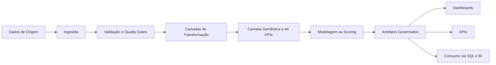
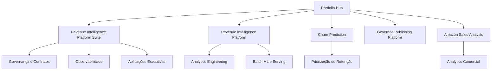
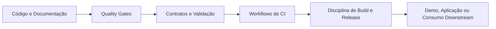
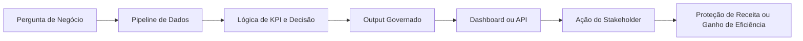

# Samuel Maia

**Portfólio premium de Analytics Engineering, revenue analytics, aplicações de BI e data products orientados à decisão**

[](https://www.linkedin.com/in/samuelmaia-analytics)
[](https://revenue-intelligence-platform.streamlit.app/)
[](https://revenue-intelligence-platform-suite.streamlit.app/)
[](https://telecom-churn-prediction-samuelmaiapro.streamlit.app/)

`Idioma:` [English](./README.md) | **Português (Brasil)**

## Resumo Executivo

Eu construo sistemas analíticos que ajudam áreas de negócio a confiar nos dados, agir com mais velocidade e tomar decisões comerciais melhores.
Este portfólio foi intencionalmente curado como uma visão sênior do meu trabalho em analytics engineering, revenue analytics, data quality, aplicações de BI e entrega analítica orientada ao negócio.

O foco não está em quantidade de projetos.
Está em valor para decisão, clareza arquitetural, outputs governados e execução crível do dado bruto ao consumo executivo.

## Proposta de Valor

Para recrutadores, este portfólio mostra uma combinação forte entre disciplina de analytics engineering e framing de negócio.

Para líderes de dados, ele demonstra como estruturo produtos analíticos com ownership claro de runtime, outputs reproduzíveis, contratos, observabilidade e caminhos downstream de consumo.

Para potenciais clientes, ele mostra como trabalho de dados pode ser traduzido em proteção de receita, priorização de retenção, padronização de KPIs e aplicações voltadas para stakeholders, em vez de notebooks isolados ou dashboards desconectados.

## Projetos em Destaque

### Revenue Intelligence Platform Suite

Principal prova de portfólio para platform thinking, suporte executivo à decisão, governança, observabilidade e integração de módulos analíticos.

- Foco: performance de receita, exposição de retenção, visibilidade de KPIs, priorização de ações
- Sinais: estrutura monorepo, contratos compartilhados, aplicação executiva, disciplina de release
- Repositório: https://github.com/samuelmaia-analytics/revenue-intelligence-platform-suite
- Demo: https://revenue-intelligence-platform-suite.streamlit.app/

### Revenue Intelligence Platform - End-to-End Analytics & ML System

É a prova técnica standalone mais forte do portfólio.
Mostra um sistema batch orientado a produção com outputs governados, artefatos de warehouse, entrega via API, consumo por dbt, UI com smoke tests e documentação operacional.

- Foco: analytics engineering end-to-end, decision support com ML, modelagem de KPIs
- Sinais: um runtime oficial, contratos, runbook, Docker, SQL, dbt, matriz de CI
- Repositório: https://github.com/samuelmaia-analytics/Revenue-Intelligence-Platform-End-to-End-Analytics-ML-System
- Demo: https://revenue-intelligence-platform.streamlit.app/

### Churn Prediction

Projeto de churn analytics orientado ao negócio, estruturado em torno de execução de pipeline, lógica de priorização, artefatos de reporting, monitoramento e usabilidade para stakeholders.

- Foco: retenção de clientes, priorização, análise de cenários, acionabilidade de negócio
- Sinais: pipeline em camadas, dashboard baseado em artefatos, surface de API, drift monitoring
- Repositório: https://github.com/samuelmaia-analytics/churn-prediction
- Demo: https://telecom-churn-prediction-samuelmaiapro.streamlit.app/

### Repositórios de Apoio Selecionados

- `SAMUEL_MAIA_DDF_TECH_032026`: publicação analítica governada, semantic marts, monitoramento operacional, consumo analítico multi-superfície
- `amazon-sales-analysis`: analytics comercial, diagnóstico de leakage de desconto, priorização por categoria, framing executivo
- `data-senior-analytics`: entrega analítica reproduzível com controles de qualidade, documentação de governança e outputs para dashboard

## Enterprise Platform Scaffold

Este repositório agora também inclui um scaffold root-level maintainable voltado a desenvolvimento de produtos analíticos em padrão enterprise.
Ele introduz uma separação clara entre `app`, `core`, `services`, `config`, `data`, `docs`, `assets` e `tests`, além de uma base funcional para FastAPI, Streamlit, data quality, semantic metrics, GenAI insights, observability e CI/CD.

Comece por aqui:

- [Architecture](./docs/architecture.md)
- [Repository Structure](./docs/repository_structure.md)
- [Quickstart](./docs/quickstart.md)

## Arquitetura Técnica

O portfólio é organizado em torno de sistemas analíticos, não de análises isoladas.
Nos principais repositórios, o modelo operacional recorrente é:

```text
dados de origem -> ingestão -> validação -> transformação -> camada semântica/de KPIs
-> modelagem ou scoring -> artefatos governados -> consumo via dashboard/API/SQL
```



Padrões arquiteturais centrais demonstrados no portfólio:

- fluxos em camadas como `raw -> bronze -> silver -> gold`
- lógica de negócio separada das camadas de apresentação
- dashboards que consomem artefatos gerados em vez de virarem uma segunda fonte de verdade
- outputs com contratos para reporting, exports processados e consumidores downstream
- reprodutibilidade local-first com caminho claro para conectores enterprise e warehouse
- produtos analíticos desenhados em torno de perguntas de negócio, não só de implementação técnica

### Arquitetura do Portfólio



## Stack

Tecnologias principais utilizadas ao longo do portfólio:

- Python
- SQL
- Streamlit
- FastAPI
- dbt
- Pandera
- scikit-learn
- MLflow
- Power BI
- Docker
- GitHub Actions
- pytest, Ruff, Black, isort, mypy

## Governança e Qualidade de Dados

Governança é uma parte visível do portfólio porque confiança analítica importa tanto quanto acurácia de modelo.

Exemplos de sinais de governança e qualidade presentes nos principais repositórios:

- data contracts e validação de schema
- estruturas explícitas de repositório e boundaries de ownership
- architecture decision records
- runbooks, guias de troubleshooting e release notes
- quality reports e artefatos processados governados
- disciplina de compatibilidade e depreciação quando existem caminhos legados
- issue templates, PR templates, CODEOWNERS e padrões de contribuição

## CI/CD

Os repositórios mais fortes vão além de testes unitários básicos.
Eles usam CI/CD como evidência de que o trabalho é reproduzível, reviewable e operacionalmente coerente.

Sinais já demonstrados no portfólio:

- lint, formatação, type checking e testes automatizados
- smoke tests para aplicações Streamlit e superfícies de API
- validação de build para pacotes e containers
- validação downstream de SQL e dbt
- checagens de governança de repositório e ativos operacionais
- workflows de release notes e publicação



## Prova de Execução

Este portfólio foi desenhado para mostrar capacidade implementada, não apenas direção pretendida.

Evidências de execução visíveis nos principais repositórios incluem:

- demos públicas em produção
- artefatos gerados e exports governados
- dashboards e APIs com smoke tests
- release notes ligadas à evolução dos repositórios
- estruturas de repositório que conectam claims documentais a código e testes

## Sinais Operacionais

Trabalho analítico de nível sênior deve ser inspecionável não apenas na camada de modelagem, mas também na camada operacional.

Sinais operacionais demonstrados ao longo do portfólio incluem:

- caminhos canônicos de runtime
- ambientes documentados e fluxos claros de setup
- runbooks, guias de troubleshooting e documentação no estilo incident
- quality gates explícitos e comandos de validação
- disciplina de release e de mudança
- reprodutibilidade local-first com caminhos de evolução voltados a contexto enterprise

## Como Eu Gero Valor de Negócio

Meu trabalho é desenhado para responder perguntas práticas como:

- Onde a receita está em risco e em que o negócio deve agir primeiro?
- Quais clientes, canais, categorias ou segmentos merecem priorização?
- Como a lógica de KPIs deve permanecer estável entre pipelines, dashboards e revisões executivas?
- Como governança, controles de qualidade e CI/CD aumentam a confiança nos outputs analíticos?

Valor tipicamente entregue por esses sistemas:

- proteção de receita por meio de lógica de priorização
- visibilidade de retenção por segmentação de risco de clientes
- ciclos de decisão mais rápidos com dashboards baseados em artefatos e camadas de KPI
- maior credibilidade analítica com outputs governados e workflows reproduzíveis
- handoff mais limpo para stakeholders com documentação, contratos e ativos operacionais



## Por Que Este Portfólio É Diferente

A maior parte dos portfólios públicos de dados otimiza por variedade de modelos ou quantidade de dashboards.
Este foi construído para mostrar como trabalho analítico se comporta quando tratado como product surface real.

O que o diferencia:

- ênfase maior em framing de negócio do que em truques técnicos isolados
- consistência arquitetural entre projetos
- sinais de governança e operação que normalmente não aparecem em portfólios
- outputs analíticos ligados a decisões de stakeholders
- ponte clara entre analytics engineering, BI, data quality e product thinking

## Estrutura do Portfólio

Este GitHub é intencionalmente organizado por prioridade, não por quantidade de projetos.

### Flagship

- `revenue-intelligence-platform-suite`

### Provas Centrais

- `Revenue-Intelligence-Platform-End-to-End-Analytics-ML-System`
- `churn-prediction`
- `SAMUEL_MAIA_DDF_TECH_032026`
- `amazon-sales-analysis`

### Profundidade de Apoio

- `data-senior-analytics`
- `analise-vendas-python`

Documentos complementares recomendados:

- [Project Index](./docs/project_index.md)
- [Portfolio Strategy](./docs/portfolio_strategy.md)
- [GitHub Positioning](./docs/github_positioning.md)
- [GitHub Execution Pack](./docs/github_execution_pack.md)

## Roadmap

Prioridades atuais de modernização do portfólio:

1. Continuar fortalecendo os repositórios flagship e core como principal hiring surface.
2. Reduzir ruído narrativo e manter visíveis apenas os repositórios que reforçam a mesma tese sênior.
3. Continuar aprofundando evidências de release, provas operacionais e validação downstream.
4. Aumentar sinais de readiness corporativo onde hoje a abordagem ainda é local-first.
5. Manter a documentação em inglês como padrão principal, com posicionamento para recrutadores sempre polido.

## Para Recrutadores

Se você está contratando para Analytics Engineer, Senior Data Analyst, Revenue Analytics, BI ou papéis ligados a data products orientados ao negócio, comece por aqui:

1. `revenue-intelligence-platform-suite` para platform thinking e entrega executiva
2. `Revenue-Intelligence-Platform-End-to-End-Analytics-ML-System` para a prova standalone mais forte de engenharia
3. `churn-prediction` para retenção, priorização e acionabilidade de negócio

O que você deve conseguir encontrar rapidamente:

- contexto de negócio claro
- arquitetura em camadas
- outputs governados
- aplicações analíticas testadas
- documentação que explica tanto a implementação quanto o modelo operacional

## Links

- GitHub: https://github.com/samuelmaia-analytics
- LinkedIn: https://www.linkedin.com/in/samuelmaia-analytics
- Revenue Intelligence Platform Demo: https://revenue-intelligence-platform.streamlit.app/
- Revenue Intelligence Platform Suite Demo: https://revenue-intelligence-platform-suite.streamlit.app/
- Churn Prediction Demo: https://telecom-churn-prediction-samuelmaiapro.streamlit.app/
- Portfolio Demo: https://samuelmaia-032026.streamlit.app/

## Contato

Se você está avaliando candidatos ou parceiros para analytics engineering, analytics orientado ao negócio, revenue analytics ou entrega de data products, este repositório é o melhor ponto de entrada para o portfólio.
